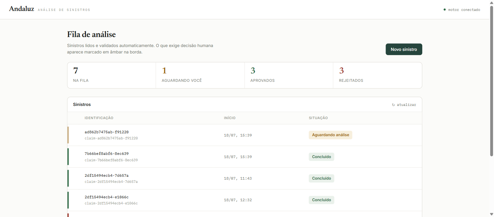
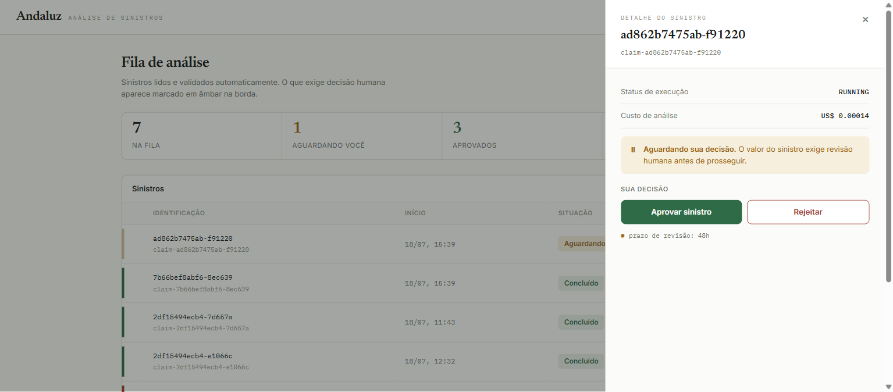
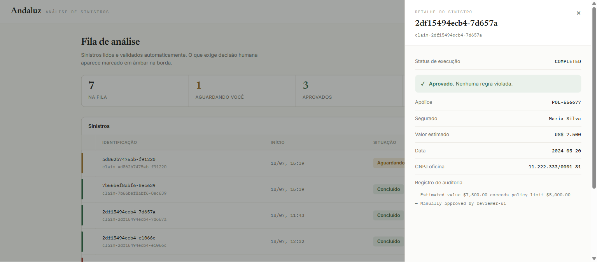
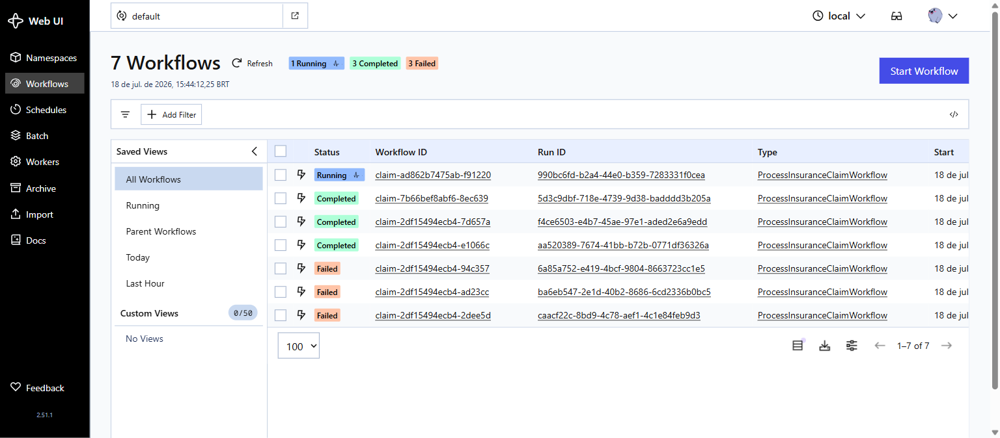

# Andaluz

Andaluz is a reference architecture and working MVP designed to explore the reliability, cost control, and auditability patterns required to run LLM-based agents in regulated production environments. 

Rather than presenting a commercial platform, this repository serves as a technical case study on separating probabilistic AI behaviors from deterministic business rules, enforcing real-time budget ceilings, and implementing durable state management.

---

## The System in Action

The analyst dashboard, where insurance claims are triaged, reviewed, and approved:



Durable human-in-the-loop: claims exceeding policy limits pause and wait for a human decision, without consuming compute:



Every decision is auditable — the trail shows why a claim was flagged and who approved it:



The Temporal engine managing durable workflow state behind the scenes:



---

## The Problem

LLMs are probabilistic by design, meaning their outputs are non-deterministic and prone to hallucinations. While this flexibility is valuable for unstructured reasoning, regulated industries (such as insurance, finance, and legal tech) demand strict determinism, predictable operational costs, and complete auditability. 

Due to these hurdles—compounded by uncontrolled API costs, hidden failure modes, and lack of human review safeguards—recent industry research estimates that approximately 40% of agentic AI projects will be abandoned by 2027. Andaluz explores the architectural patterns required to mitigate these risks and bridge the gap between AI flexibility and enterprise reliability.

---

## Architectural Pillars

Andaluz's implementation demonstrates four core reliability patterns:

1. **Probabilistic/Deterministic Separation:** LLMs are used exclusively for parsing and extracting data from unstructured sources into structured models. Once structured, all business rule evaluation (e.g., CNPJ tax validation, date logic, policy limits) is handled by deterministic, testable Python code.
2. **Durable Human-in-the-Loop (HITL):** When an extraction triggers manual review thresholds, the workflow state is persisted durably using Temporal. The execution yields and can pause for up to 48 hours waiting for an external approval signal without consuming active compute resources.
3. **FinOps Gateway Guardrails:** Every LLM execution is routed through a LiteLLM gateway that calculates request cost in real time based on actual token consumption and model-specific pricing tables. The workflow automatically aborts if the accumulated cost exceeds the user's defined budget ceiling.
4. **Auditability and Failure Precedence:** Every step, cost calculation, and validation check is logged. Hard failures (e.g., invalid document formatting or future dates) trigger immediate rejection, bypassing and taking precedence over human review workflows to optimize manual reviewer bandwidth.

---

## System Architecture

```text
               +-------------------------------------------------+
               |             Analyst Dashboard (UI)              | (Port 3000)
               +-------------------------------------------------+
                                        |
                                        | HTTP
                                        v
               +-------------------------------------------------+
               |                   API Bridge                    | (Port 8000)
               +-------------------------------------------------+
                                        |
                                        | gRPC
                                        v
               +-------------------------------------------------+
               |                Temporal Server                  | (Port 7233)
               +-------------------------------------------------+
                       ^                                ^
                       | gRPC                           | gRPC
                       v                                v
         +---------------------------+    +---------------------------+
         |    Temporal Web Console   |    |      Andaluz Worker       |
         |        (Port 8088)        |    +---------------------------+
         +---------------------------+                  |
                                                        | HTTP
                                                        v
                                          +---------------------------+
                                          |      LiteLLM Gateway      | (Port 4000)
                                          +---------------------------+
                                                        |
                                                        | HTTP
                                                        v
                                          +---------------------------+
                                          |     LLM API Provider      | (NVIDIA NIM)
                                          +---------------------------+
```

### Technology Decisions

* **Analyst Dashboard (Web UI):** A lightweight Nginx service serving an interactive SPA that enables claim analysts to register new unstructured claims, monitor active processing pipelines, and resolve Human-in-the-Loop review requests visually.
* **API Bridge (FastAPI):** A bridge API exposing REST endpoints that translates client HTTP requests into Temporal gRPC client commands, queries active workflow memory states, and signals external decisions.
* **Temporal:** Chosen to manage workflow state. In a traditional database-and-queue setup, managing a 48-hour pause, retries, and state persistence requires complex orchestration. Temporal provides durable execution, making the code resilient to worker restarts and server outages.
* **LiteLLM Proxy:** Used as an intelligent model gateway. It handles model routing, fallbacks, and calculates per-token cost dynamically before returning the response to the worker, keeping the worker decoupled from model provider specifics.
* **Pydantic:** Enforces strict, type-safe data parsing. Pydantic schemas are passed directly to the LLM to enforce structured outputs, and validate input parameters at the worker boundary.

---

## How to Run

### Prerequisites
* Docker and Docker Compose installed.
* An NVIDIA NIM API Key (or another LLM provider API key).

### Setup and Startup

1. Clone this repository and navigate to its root directory.
2. Create a `.env` file in the root directory:
   ```env
   NVIDIA_API_KEY=your_nvidia_api_key_here
   LITELLM_MASTER_KEY=sk-andaluz-master-key-dev
   ```
3. Build and start the complete stack:
   ```bash
   docker compose -f docker-compose.dev.yml up -d --build
   ```
4. Verify the containers are running and healthy. Once running locally, the services are available at:
   * **Analyst Dashboard (Web UI):** [http://localhost:3000](http://localhost:3000)
   * **API Bridge (FastAPI):** [http://localhost:8000](http://localhost:8000)
   * **Temporal Web Console:** [http://localhost:8088](http://localhost:8088)
   * **LiteLLM Gateway:** [http://localhost:4000](http://localhost:4000)

### Running the Test Scenarios

Execute the automated test script inside the worker container:
```bash
docker exec -e PYTHONUNBUFFERED=1 andaluz-worker python /app/test_claim.py
```

This runs three distinct verification scenarios:
* **Scenario A (Manual Review & Approval):** A claim for `$7,500` is submitted (exceeding the `$5,000` auto-pass limit). The workflow pauses in the `AWAITING_HUMAN` state. The test script queries this status, simulates a reviewer, and sends a `submit_human_review` signal (`APPROVE`), moving the workflow to `Completed` on the Temporal UI.
* **Scenario B (Automatic Rejection):** A claim with a future date (`2029-08-10`) is submitted. The workflow detects this deterministic rule violation and rejects the claim immediately, skipping the LLM-costly human review loop.
* **Scenario C (FinOps Budget Rejection):** A claim is submitted with a budget limit of `$0.000001`. The actual processing cost calculated by LiteLLM based on token counts exceeds the budget, causing the workflow to abort immediately with `BUDGET_EXCEEDED`.

---

## Architecture Decisions & Trade-Offs

### 1. Token-Based Costing vs. Flat-Rate Estimations
* **Decision:** We configured the LiteLLM gateway with model-specific token pricing (`$0.15/M` input, `$0.60/M` output for Llama 3.1 8B). LiteLLM calculates the exact cost dynamically using the actual token count of each request and passes it back in the headers.
* **Why:** In production, flat-rate assumptions fail to capture outlier documents (e.g., a massive 50-page claim report). Dynamic pricing ensures the FinOps guardrail measures real usage.
* **What we gave up:** We introduced dependency on gateway-level metadata. If the gateway fails to calculate or return the cost header, the system must rely on local fallback estimations.

### 2. Precedence of Hard Failures over Manual Review
* **Decision:** Rule validation happens sequentially. If a hard failure (like an invalid tax ID format or a future date) is detected, the claim is rejected immediately, even if it also exceeded policy values that would normally trigger human review.
* **Why:** Human attention is the most expensive resource in a business process. Rejecting obviously malformed claims automatically preserves reviewer bandwidth.
* **What we gave up:** Loss of comprehensive validation feedback. A claim that has both a bad CNPJ and an exceeded budget will fail first on the CNPJ, masking subsequent errors until the user corrects and resubmits the claim.

### 3. Idempotency via Document Hash Workflow IDs
* **Decision:** The workflow ID is derived directly from the SHA-256 hash of the source document (`claim-doc-hash-<hash_suffix>`). 
* **Why:** Deriving the ID from the document content prevents duplicate processing of the same claim. If a user clicks "submit" twice, Temporal automatically routes the second request to the existing workflow execution (throwing a `WorkflowExecutionAlreadyStartedError` if active), enforcing idempotency out-of-the-box.
* **What we gave up:** The ability to reprocess the same physical document for legitimate revisions. To resubmit a corrected version of the same document, the system must generate a new unique hash (e.g. by appending metadata) or run on a separate run ID.

---

## Limitations & Next Steps

This repository is a reference architecture study and intentionally omits production-grade features that would be required in a commercial product:

* **No Authentication or RBAC:** There is no user authentication, session management, or Role-Based Access Control. Any client can connect to the Temporal gRPC port or signal approval.
* **No WORM (Write Once Read Many) Audit Logs:** Audit logs are written to PostgreSQL via Temporal's history and worker logging. A production system would write these immutable records to a WORM storage compliance engine.
* **No OTel Observability:** OpenTelemetry metrics and tracing are not configured in the Docker Compose environment.

---

## Author Context

This reference architecture was built by **Bruno Aragão** as an exploration of the real-world reliability challenges of applying AI to highly regulated, deterministic business pipelines—demonstrating that reliability is an architectural concern, not just a model quality concern.

* **GitHub:** [@aragaobruno](https://github.com/aragaobruno)
* **LinkedIn:** [Bruno Aragão](https://www.linkedin.com/in/aragaobruno/)
